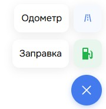

# FabButton

Плавающая кнопка-действие (FAB) со speed-dial меню: по клику разворачивает анимированный список пунктов вверх, иконка кнопки поворачивается. Клик по пункту отдаёт его `value`.

## Пропсы

- `items` — список пунктов меню (заголовок, значение, иконка, класс иконки)
- `onFabItemClick` — колбэк по клику на пункт, получает его `value`
